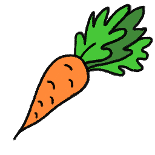

# Reinforcement-Learning for Maze Solving

 
Projekt ten stanowi implementację agenta uczenia ze wzmacnianiem, który zdobywa umiejętność rozwiązywania labiryntu przy użyciu algorytmu Q-learning. Dodatkowo, zawiera również generator labiryntów, który tworzy zróżnicowane trasy do eksploracji przez agenta.

## 🚀 Czym Jest Reinforcement Learning?

Reinforcement Learning, czyli uczenie ze wzmacnianiem, to koncepcja z dziedziny sztucznej inteligencji, gdzie agent uczony jest podejmować decyzje w dynamicznym środowisku. Kluczowym elementem jest to, że agent zdobywa doświadczenie, interakcjonując z otoczeniem, i otrzymuje informację zwrotną w postaci nagród lub kar.

### 👾 Kluczowe Elementy RL:

- **Agent:** To podmiot, który podejmuje decyzje w środowisku, starając się maksymalizować zdyskontowaną sumę nagród.

- **Środowisko:** To kontekst, w którym agent działa. Środowisko reaguje na decyzje agenta, dostarczając nowych stanów i nagród.

- **Akcje:** Są to decyzje podejmowane przez agenta w danym stanie środowiska.

- **Stany:** Reprezentują określony kontekst lub sytuację w środowisku.

- **Nagrody:** Są używane do oceny decyzji agenta. Cel agenta to maksymalizacja łącznej zdyskontowanej sumy nagród.

- **Funkcja Wartości:** Ocenia, jak dobre są różne stany lub akcje w danym kontekście.

- **Exploration vs. Exploitation:** Agent musi zbalansować eksplorację nowych działań i eksploatację już znanego, aby osiągnąć optymalne wyniki.

### 🔍 Dlaczego To Ważne?

Reinforcement Learning ma szerokie zastosowanie, od sterowania robotami po automatyczne podejmowanie decyzji w grach komputerowych. To narzędzie umożliwia agentom samodzielne doskonalenie strategii, poprzez interakcję z otoczeniem.

## 📎 Generowanie Labiryntów

Projekt wykorzystuje algorytm "recursive backtracking" do generowania labiryntów w formie tablicy 2D. Każda tablica reprezentuje unikalny labirynt, gdzie:
- 1: Ściana
- 0: Ścieżka
- 2: Koniec labiryntu
- 3: Początek labiryntu

## 📸 Zrzuty Ekranu

## 👩🏽‍💻🧑🏽‍💻 Autorzy

Kod: Miłosz Klim, Wydział Fizyki, Technologie Komputerowe semestr V
Grafika: Wiktoria Bielecka, Wydział Fizyki, Technologie Komputerowe semestr V
Grudzień 2023